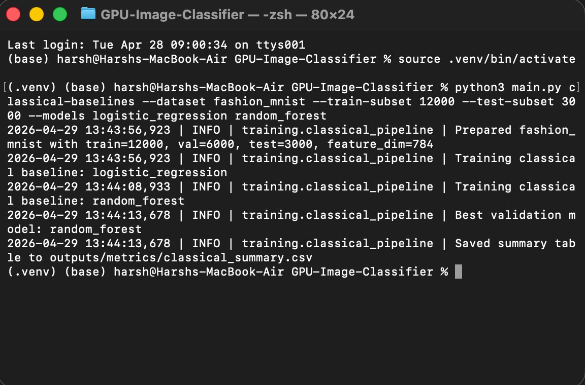
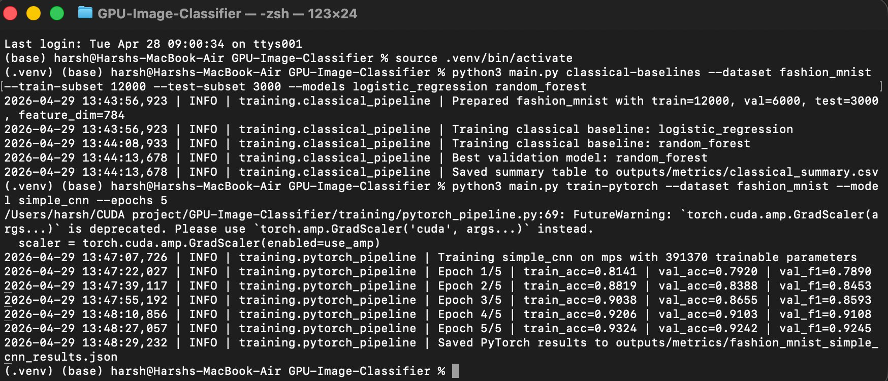
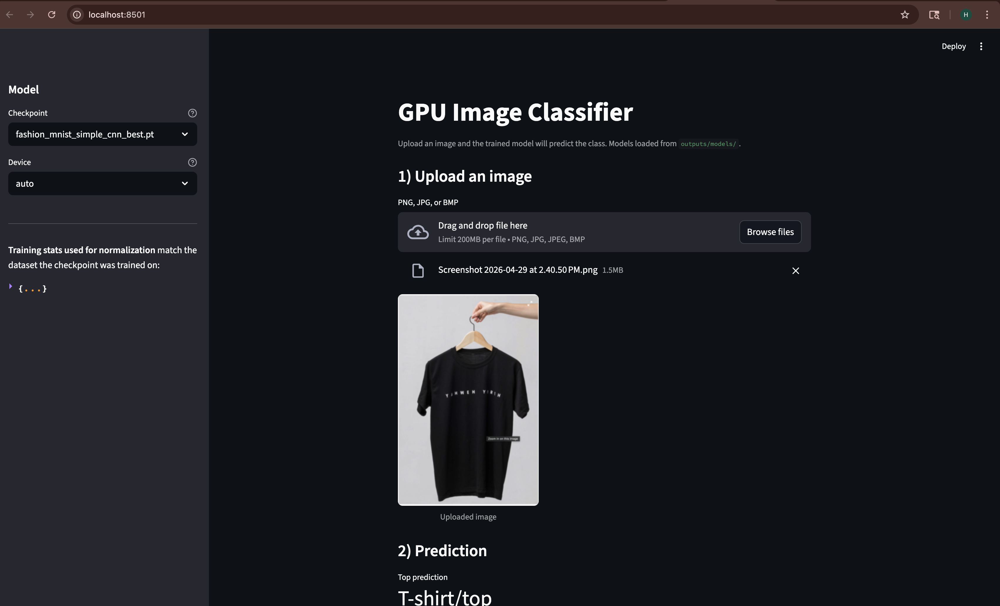
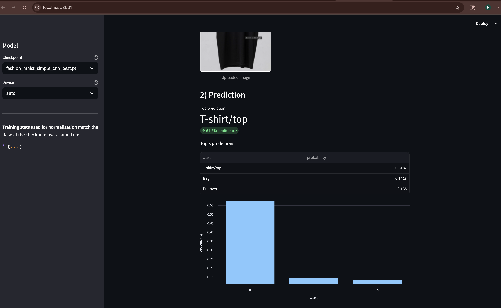
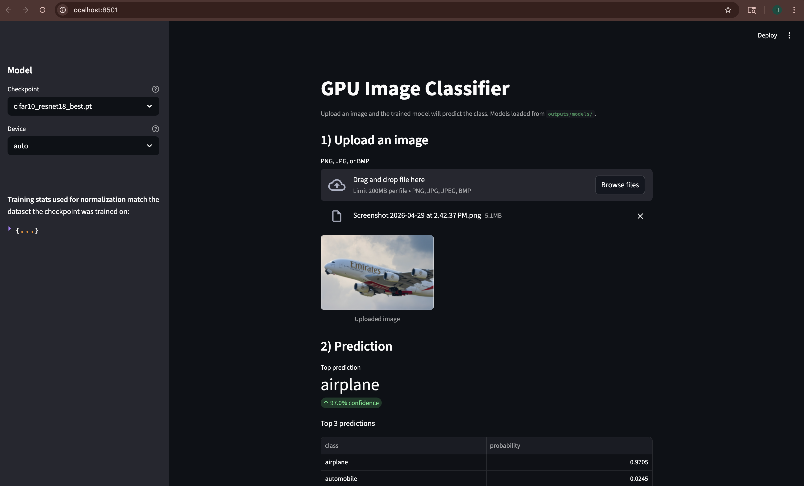
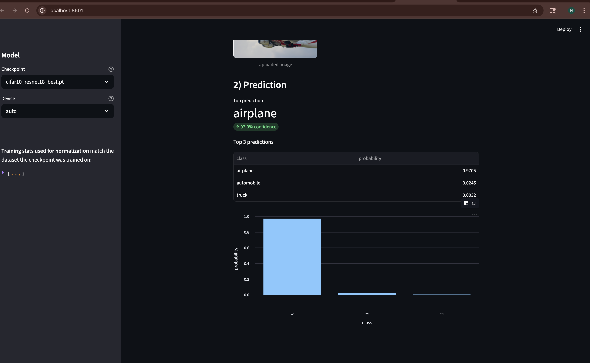

# GPU-Accelerated Image Classification System

A production-quality, resume-ready project that combines classical machine learning, deep learning, and custom GPU kernels into one reproducible image-classification pipeline.

The project is being built in milestones so each layer stays understandable and maintainable:

1. Project setup
2. Dataset loading and preprocessing
3. Classical ML baselines
4. PyTorch CNN training
5. Pretrained ResNet18 fine-tuning
6. Custom CUDA kernel
7. Triton kernel
8. Benchmarking and comparison
9. Optional demo app

All nine milestones are now implemented. The repo includes an operator-level benchmarking path for image normalization across CPU PyTorch, PyTorch CUDA, a custom CUDA extension, and Triton, plus a Streamlit inference demo and a unified report generator that combines results across pipelines.

## Why Fashion-MNIST First?

Fashion-MNIST is the default dataset because it is:

- fast to download and iterate on
- easy to flatten for scikit-learn baselines
- still realistic enough for CNN and benchmarking work

The code is structured so you can switch to `cifar10` from the CLI without changing the pipeline.

## Current Features

- deterministic dataset download and stratified train/validation/test handling
- reusable preprocessing utilities for both classical ML and future PyTorch training
- classical baselines:
  - Logistic Regression
  - Linear SVM
  - Random Forest
- deep learning models:
  - custom CNN built from scratch in PyTorch
  - ResNet18 with optional pretrained weights and backbone freezing
- GPU-aware PyTorch training with automatic device selection:
  - CUDA when available
  - MPS fallback on Apple Silicon
  - CPU fallback otherwise
- operator-level GPU optimization:
  - custom CUDA kernel for NCHW image normalization
  - matching Triton kernel for the same operation
  - benchmark harness that validates correctness and compares latency/bandwidth
- evaluation outputs:
  - accuracy
  - precision
  - recall
  - F1-score
  - confusion matrix
  - ROC-AUC when the model exposes usable scores
- artifact generation:
  - JSON metrics
  - CSV summary tables
  - kernel benchmark CSV and JSON reports
  - confusion-matrix plots
  - training-history curves
  - kernel benchmark comparison plots
  - serialized sklearn models
  - best-model PyTorch checkpoints

## Project Structure

```text
project/
│── app/
│── benchmarking/
│── cuda_kernels/
│── data/
│   ├── raw/
│   ├── processed/
│   └── dataset_manager.py
│── evaluation/
│── models/
│── training/
│── triton_kernels/
│── utils/
│── outputs/
│── main.py
│── pyproject.toml
│── README.md
```

## Setup

```bash
python3 -m venv .venv
source .venv/bin/activate
pip install --upgrade pip
pip install -e .
```

If you want linting and tests as well:

```bash
pip install -e ".[dev]"
```

If you want the GPU benchmarking extras on a Linux machine with NVIDIA CUDA:

```bash
pip install -e ".[gpu]"
```

The custom CUDA extension also requires a working CUDA toolkit with `nvcc` available through `CUDA_HOME`.

For the Streamlit inference demo:

```bash
pip install -e ".[demo]"
```

## Run The Current Milestone

Run the classical baseline pipeline on Fashion-MNIST:

```bash
python3 main.py classical-baselines --dataset fashion_mnist
```

For faster local iteration:

```bash
python3 main.py classical-baselines --dataset fashion_mnist --train-subset 12000 --test-subset 3000
```

To switch datasets:

```bash
python3 main.py classical-baselines --dataset cifar10 --train-subset 15000
```

Train the custom CNN:

```bash
python3 main.py train-pytorch --dataset fashion_mnist --model simple_cnn --epochs 10
```

Train ResNet18 with pretrained weights:

```bash
python3 main.py train-pytorch --dataset cifar10 --model resnet18 --use-pretrained --epochs 12
```

Freeze the ResNet18 backbone for a fast transfer-learning baseline:

```bash
python3 main.py train-pytorch --dataset cifar10 --model resnet18 --use-pretrained --freeze-backbone --epochs 8
```

Run the image-normalization benchmark:

```bash
python3 main.py benchmark-kernels --operation image_normalization
```

Use a smaller tensor while you are iterating locally:

```bash
python3 main.py benchmark-kernels --batch-size 16 --channels 3 --height 64 --width 64 --benchmark-iterations 20
```

Generate a unified markdown report combining the latest classical, PyTorch, and benchmark results:

```bash
python3 main.py generate-report
```

The report is written to `outputs/reports/run_summary.md`. It auto-discovers whatever metric files exist under `outputs/metrics/`, so you can re-run it any time after a fresh experiment.

Run the Streamlit inference demo (after `pip install -e ".[demo]"`):

```bash
streamlit run app/inference_app.py
```

The app loads any saved checkpoint from `outputs/models/`, lets you upload an image, and shows the top-3 predicted classes with probabilities. Use the sidebar to switch between models or pick a specific device (CUDA / MPS / CPU). Image preprocessing matches the per-channel mean/std the model was trained on.

## Sample Run Logs

The screenshots below come from a real run on a MacBook Air (Apple Silicon), captured on 2026-04-29. They show the CLI in action across the classical and deep-learning milestones.

### Classical Baselines on Fashion-MNIST



A short run with the `classical-baselines` command using a 12,000-sample stratified training subset and a 3,000-sample test subset. Logistic Regression trains in roughly 11 seconds and Random Forest in about 4 seconds. The pipeline picks Random Forest as the best validation model and writes the leaderboard to `outputs/metrics/classical_summary.csv`. On this subset, Random Forest reaches **0.858 test accuracy** and **0.987 ROC-AUC**, with Logistic Regression close behind at **0.825 test accuracy**.

### SimpleCNN Training on MPS



The `train-pytorch` command running the custom `simple_cnn` architecture on Apple Silicon's MPS backend for 5 epochs. The model has 391,370 trainable parameters. Validation accuracy climbs from 0.792 in the first epoch to **0.924 by epoch 5**, comfortably beating the Random Forest baseline by roughly 5.5 points on test accuracy (final test accuracy **0.913**, ROC-AUC **0.995**). The cosine learning-rate schedule decays from 9e-4 down to 0 across the run, which is why the largest validation jump appears at epoch 4 once the learning rate is small enough for fine-tuning.

### Streamlit Inference Demo - Fashion-MNIST



The Streamlit demo app running locally at `http://localhost:8501`. The sidebar shows the active checkpoint (`fashion_mnist_simple_cnn_best.pt`) and the resolved device (`auto`, which falls back to MPS on Apple Silicon). The user has uploaded a black T-shirt product photo, which the app immediately previews under "Uploaded image" before running inference. The app auto-discovers any `.pt` checkpoint placed in `outputs/models/`, so you can switch between models without restarting the server.



The same flow scrolled down to the prediction panel. The model correctly identifies the image as **T-shirt/top with 61.9% confidence**, with Bag (14.2%) and Pullover (13.5%) as the runners-up. The probability bar chart visualizes how the model distributed its score across the top three classes, which makes calibration and ambiguity easy to read at a glance. Image preprocessing matches training exactly: convert to grayscale, resize to 28x28, and normalize with the per-channel statistics defined in `data/dataset_manager.DATASET_STATS`.

### Streamlit Inference Demo - CIFAR-10 ResNet18



The same demo app, but with the sidebar switched to `cifar10_resnet18_best.pt`. The user has uploaded a photo of an Emirates airplane in flight. Because this is a CIFAR-10 model, the app preprocesses the image as RGB at 32x32 with the CIFAR-10 mean/std, instead of the grayscale 28x28 path used for Fashion-MNIST. The dropdown driven device selector still works the same way - the model is moved to the chosen device when it loads.



The prediction view for the airplane image. The fine-tuned ResNet18 nails the class with **97.0% confidence on "airplane"**, with automobile a distant second at 2.5% and truck at 0.3%. This is a clean, high-confidence prediction on a clearly in-distribution image, which contrasts with the more ambiguous Fashion-MNIST result above and demonstrates that the same demo app handles both grayscale clothing and natural RGB imagery correctly.

## Outputs

Artifacts are written under `outputs/`:

- `outputs/metrics/classical_summary.csv`
- `outputs/metrics/classical_results.json`
- `outputs/metrics/*_history.csv`
- `outputs/metrics/*_summary.csv`
- `outputs/metrics/*_results.json`
- `outputs/metrics/image_normalization_*_benchmark.csv`
- `outputs/metrics/image_normalization_*_benchmark.json`
- `outputs/figures/*_confusion_matrix.png`
- `outputs/figures/*_training_curves.png`
- `outputs/figures/image_normalization_*_benchmark.png`
- `outputs/models/*.joblib`
- `outputs/models/*.pt`
- `outputs/reports/run_summary.md`

## Architecture Overview

### Data Layer

`data/dataset_manager.py` handles dataset download, split creation, split caching, flattening for scikit-learn, train/eval transforms, and PyTorch DataLoader creation with optional stratified subsampling.

### Model Layer

`models/classical_models.py` centralizes sklearn estimator construction, and `models/pytorch_models.py` exposes the custom CNN plus ResNet18 adaptation logic for grayscale or RGB datasets.

### Training Layer

`training/classical_pipeline.py` runs the sklearn baselines, while `training/pytorch_pipeline.py` handles GPU-aware training, validation-based model selection, checkpointing, and final test evaluation.

### Evaluation Layer

`evaluation/metrics.py` keeps metrics logic in one place, which avoids scattered scoring code and makes later model comparisons much easier.

### GPU Kernel Layer

`cuda_kernels/image_normalization.py` loads a custom CUDA extension for per-channel image normalization, while `triton_kernels/image_normalization.py` implements the same NCHW operation in Triton for side-by-side benchmarking.

### Benchmark Layer

`benchmarking/image_normalization_benchmark.py` generates synthetic image tensors, validates each backend against the PyTorch reference implementation, times warmup and measured iterations, computes effective bandwidth, and saves CSV, JSON, and plot artifacts.

### Reporting Layer

`evaluation/report.py` walks `outputs/metrics/` and stitches the most recent classical, PyTorch, and kernel benchmark results into a single markdown summary at `outputs/reports/run_summary.md`. Sections with no data are skipped automatically, so the report stays useful when only some pipelines have been run.

### Demo App

`app/inference_app.py` is a Streamlit front end that auto-discovers checkpoints under `outputs/models/`, normalizes uploaded images using the same per-channel statistics used during training, and shows the top-3 predictions with their probabilities. It works on CPU, MPS, or CUDA depending on which devices are available.

## GPU Kernel Benchmark Results

All four backends were benchmarked on a **Tesla T4 GPU** (Google Colab) with a synthetic tensor of shape `[64, 3, 224, 224]` over 100 measured iterations. The custom CUDA kernel was profiled with Nsight Compute and then optimized before the final numbers below were captured.

| Backend | Median Latency | Bandwidth | Speedup vs CPU |
|---|---|---|---|
| torch_cpu | 37.39 ms | 2.06 GB/s | 1.0x |
| torch_cuda | 0.74 ms | 104.79 GB/s | 50.8x |
| cuda_extension | **0.35 ms** | **222.05 GB/s** | **107.7x** |
| triton | 0.39 ms | 198.21 GB/s | 96.2x |

The custom CUDA extension is **2.1x faster than PyTorch's own CUDA implementation** and outperforms the Triton kernel at this tensor size.

### Kernel Optimization with Nsight Compute

Nsight Compute profiling on the initial v1 kernel revealed two bottlenecks:

- **SM throughput at 48% of peak** — caused by a 64-bit integer division `(index / channel_stride) % channels` running on every thread, producing 359 million integer instructions for 9.6 million elements (~37 int ops per element)
- **Memory bandwidth at 120 GB/s** (37% of T4's 320 GB/s peak) — caused by scalar `float` loads issuing one memory transaction per element

The v2 kernel addresses both:

- **`float4` vectorized loads** — 4 elements read per thread, reducing memory transactions by 4x and raising effective bandwidth from 148 GB/s to 222 GB/s
- **3D grid launch** — channel index comes free from `blockIdx.y` and batch index from `blockIdx.z`, eliminating all integer division from the hot path

Result: **33% latency reduction** (0.52 ms → 0.35 ms) and **50% bandwidth improvement** (148 GB/s → 222 GB/s).

## Notes About GPU Work

The classical and PyTorch milestones work on CPU-only machines. The kernel benchmark command also runs on CPU-only machines but will skip the CUDA and Triton backends — a CUDA-capable NVIDIA GPU is required to benchmark all four paths. Apple Silicon MPS helps for model training but does not support the custom CUDA extension or Triton kernel.

## Next Steps

The original nine milestones are complete. Reasonable directions for further work:

1. Add a second optimized operator such as depthwise convolution or matrix multiplication to broaden the kernel benchmark surface.
2. Add an optional FastAPI inference service so the same checkpoints can be served programmatically alongside the Streamlit demo.
3. Extend Nsight profiling to the Triton kernel to compare low-level metrics between the two GPU backends.

